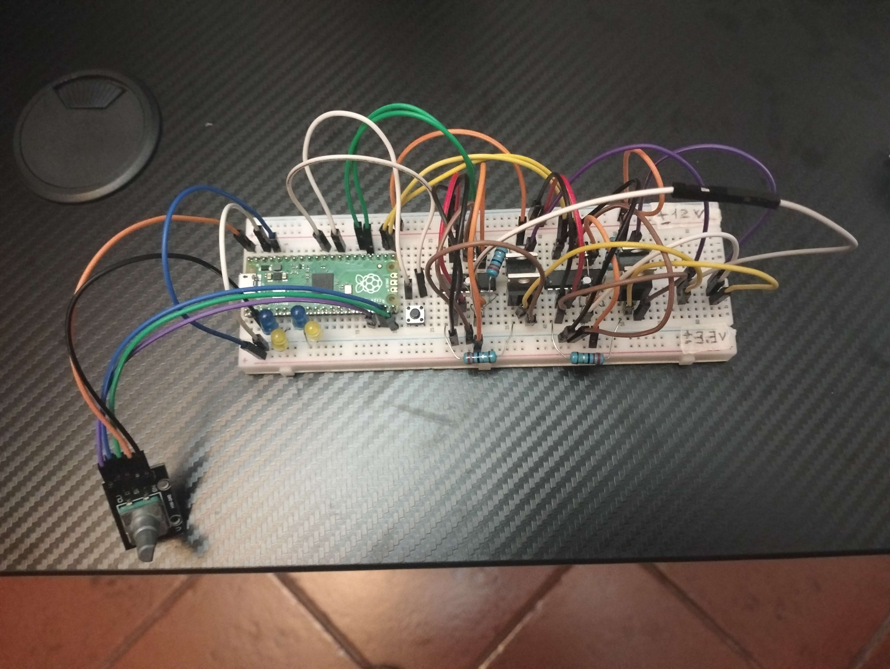
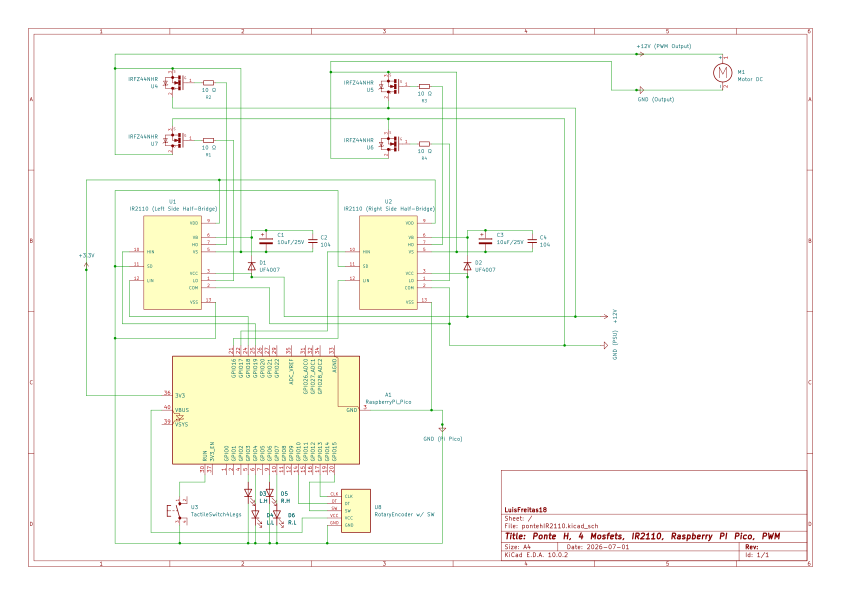

# i2110_h-bridge_4mosfets_w-leds

Projeto de bancada para controlar um motor DC com uma ponte H discreta, 4 MOSFETs e 2 drivers IR2110, com Raspberry Pi Pico.

## Montagem

## Esquema KiCad

- [Esquema em PDF](kicad/pontehIR2110.pdf)
- [Ficheiro fonte do KiCad](kicad/pontehIR2110.kicad_sch)

## O que este projeto faz

- lê o encoder rotativo para subir ou baixar o PWM
- usa o botão do encoder para inverter a polaridade da ponte H
- só ativa um lado da ponte H de cada vez
- desliga tudo antes de trocar de estado para evitar problemas entre high-side e low-side

## Pinagem

### Encoder

- CLK: GPIO 13
- DT: GPIO 14
- SW: GPIO 15

### IR2110

- Left Low: GPIO 18
- Left High: GPIO 19
- Right Low: GPIO 16
- Right High: GPIO 17

### LEDs de teste

- Left High LED: GPIO 3
- Left Low LED: GPIO 4
- Right High LED: GPIO 6
- Right Low LED: GPIO 7

## Lógica do firmware

- Polaridade Direta: Left Low ligado e PWM no Right High
- Polaridade Invertida: Right Low ligado e PWM no Left High
- o valor de PWM anda em passos de 5
- sempre que há uma mudança, a ponte é desligada primeiro e só depois volta a ligar

## Bootstrap e IR2110

O IR2110 precisa de bootstrap para conseguir ligar o MOSFET high-side. Por isso foram usados o diodo UF4007 e dois condensadores em paralelo:

- o condensador eletrolítico dá reserva de energia maior e ajuda quando há variações mais lentas
- o condensador cerâmico responde mais depressa aos picos e ao ruído de comutação
- o diodo UF4007 carrega o bootstrap rapidamente e impede o retorno de corrente para a alimentação

Isto é importante porque o high-side não fica disponível de forma contínua sem renovar a carga do bootstrap. Na prática, convém ter estes cuidados no IR2110:

- a massa do Pico, do driver e da fonte de potência tem de ser comum
- o VCC/VDD do driver e o lado de potência têm de estar bem desacoplados
- não convém depender de duty cycle a 100% no high-side durante muito tempo sem refresh do bootstrap
- é boa ideia manter algum tempo morto entre desligar um lado e ligar o outro

## Upload

O PlatformIO compila este projeto em framework Arduino, mas o upload para o Pico em modo BOOTSEL costuma ser um problema porque o Pico aparece como armazenamento USB e não como porta serial normal. Por isso existe um script de upload automático.

Esse script procura a unidade `RPI-RP2` e copia o `firmware.uf2` diretamente para lá.

O botão tátil de 4 pernas serve para encurtar RUN com GND e assim fazer reset ao Pico ou colocá-lo em modo bootloader sem ter de tirar o cabo micro USB. Simples, mas dá jeito na bancada.lecdeo audc

### Passos

1. pôr o Pico em BOOTSEL
2. compilar no PlatformIO
3. fazer upload normalmente no PlatformIO
4. deixar o script tratar da cópia automática para o Pico

## Ficheiros principais

- [main.cpp](i2110_h-bridge_4mosfets_w-leds_PlatformIO/src/main.cpp)
- [platformio.ini](i2110_h-bridge_4mosfets_w-leds_PlatformIO/platformio.ini)
- [upload_uf2_rpi-pico.py](i2110_h-bridge_4mosfets_w-leds_PlatformIO/upload_uf2_rpi-pico.py)

## Notas rápidas

- usar massa comum entre Pico, drivers e fonte da ponte H
- testar primeiro com fonte limitada em corrente
- confirmar dissipação dos MOSFETs antes de ligar o motor a sério

Isto é só para testar a ponte H e perceber bem o comportamento do circuito sem complicar demais.
